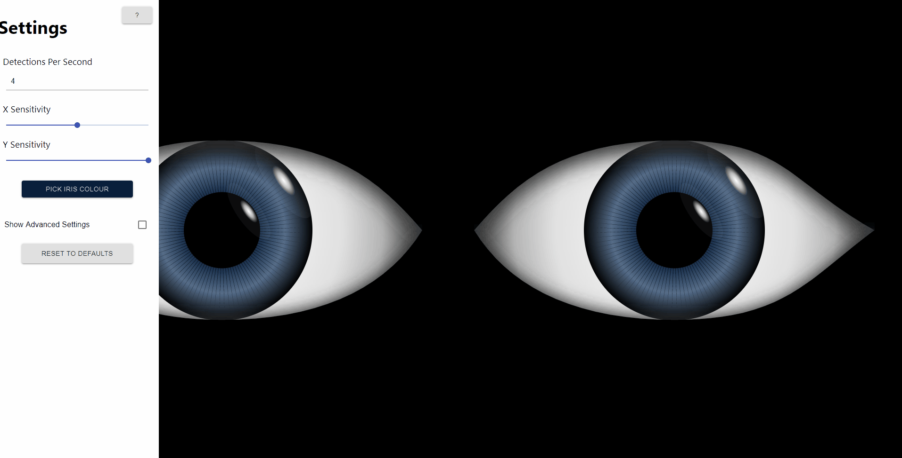

<!-- PROJECT SHIELDS -->

[](https://circleci.com/gh/ScottLogic/lookingatyou)

<!-- PROJECT LOGO -->
<br />
<p align="center">

  <h1 align="center">Looking At You</h1>

  <p align="center">
    <a href="https://github.com/ScottLogic/lookingatyou/blob/master/README.md"><strong>Explore the docs »</strong></a>
    <br />
    <a href="https://looking-at-you.s3.amazonaws.com/index.html">View Demo</a>
    ·
    <a href="https://github.com/ScottLogic/lookingatyou/issues">Report Bug</a>
    ·
    <a href="https://github.com/ScottLogic/lookingatyou/issues">Request Feature</a>
    ·
    <a href="https://blog.scottlogic.com/2019/08/19/LookingAtYou.html">Read the Blog</a>
  </p>
</p>

## Table of Contents

-   [About the Project](#about-the-project)
-   [Prerequisites](#prerequisites)
    -   [General](#general)
    -   [Tests](#tests)
-   [Running the project (local)](#running-the-project-locally)
-   [Usage](#usage)
-   [Testing](#testing)
-   [Deployment](#deployment)

## About The Project

Looking At You is a single page application that tracks a person using [PoseNet](https://github.com/tensorflow/tfjs-models/tree/master/posenet) and follows them with a pair of eyes on the screen. Looking At You was developed by [Scott Logic](https://www.scottlogic.com/)'s Summer 2019 interns in the Edinburgh office.


## Prerequisites

### General

In order to build and run the project, a package manager like npm or yarn is required.

### Tests

Tests have a single requirement - [JEST](https://jestjs.io/). You can install it by using the following command from the project root directory:

```
npm install
```

which will install any dependencies of the project based off of the package.json file.

## Running the project locally

Install the dependencies:

```
npm install
```

To run the project locally, run the following command:

```
npm start
```

This will start the node server and you can access the project on [http://localhost:3000](http://localhost:3000)

## Usage

When you first access the application, you will be asked for the permission to access the webcam - click 'Allow'.

When mouse movement is detected on the screen, the configuration menu will open where certain settings can be adjusted. Following options are currently available:

| Option                 | Description                                                                             |
| ---------------------- | --------------------------------------------------------------------------------------- |
| Detections per Second  | Sets the number of detections per second for the object detection                       |
| X Sensitivity          | X axis eyes sensitivity                                                                 |
| Y Sensitivity          | Y axis eyes sensitivity                                                                 |
| Iris Colour            | Changes the colour of the Iris                                                          |
| Show Advanced Settings | Shows some extra settings for users that are technically familiar with object detection |



## Pose Interaction

There is a feature in the application that will make the eyes interact in a unique way if you hold certain poses.

| Current Poses   |
| --------------- |
| Left hand wave  |
| Right hand wave |
| Arms above head |
| T-shape pose    |

If you would like to add additional poses go to `src/utils/pose/poseDetection.ts` and define a new pose based on the available key point data. You can then define an animation in `src/utils/pose/animations.ts` as an array of keyframes where you can control the iris position, the iris colour, the open coefficient, and the dilation coefficient. This animation can then be mapped to the pose as shown in the file.

## Reflection

By default there is a reflection of the target shown in the iris with a slight fish-eye effect applied. The intesity of the reflection can be changed in the advanced settings or switched off entirely.

## Advanced Settings

The advanced settings contain the settings to configure PoseNet, all the settings have a descriptive tooltip when you hover over them that should help you understand what each setting is for. These settings provide in-depth performance controls for the app and will help you tune the app to run best on your machine. However, if you do change some settings and that has a bad impact on the performance of the app you can click the 'reset to defaults' button which will return the settings to the defaults.

## Testing

All tests commands must be run from the root directory of the project.

In order to run the unit tests run the following command:

```
npm run test
```

To view the test coverage of the project run:

```
npm run coverage
```

To ensure that your code meets the linter requirements of the project run:

```
npm run lint
```

## Deployment

Looking At You is automatically deployed to a S3 bucket after each successful merge to the master branch. The project can be accessed [here](https://looking-at-you.s3.amazonaws.com/index.html).

Any branch prepended with `feature/` will also be automatically deployed after passing the required linting check and tests. Feature branches can be accessed at `https://looking-at-you.s3.amazonaws.com/BRANCH_NAME` where `BRANCH_NAME` is the name of the feature branch you are trying to access. Those branches are automatically deleted either in following scenarios:

-   after they are merged to master branch, or
-   they have been closed without merging.

Please note, that the closed branches are not automatically deleted from AWS after closing them. Instead, they will be deleted during the deployment of any other branch.

In order to deploy the application manually first install all dependencies and build the project:

```
npm install
npm run build
```

Once the project is built, you can deploy it to AWS S3 bucket with following command:

```
aws s3 sync ./build/ s3://<bucket-name>/ --delete
```
